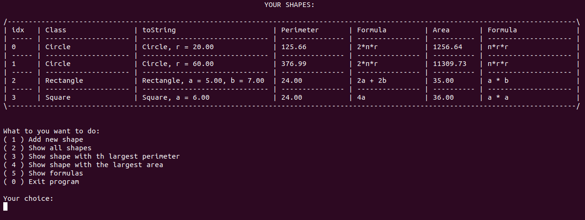
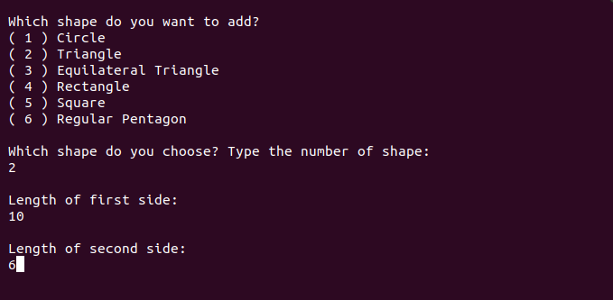
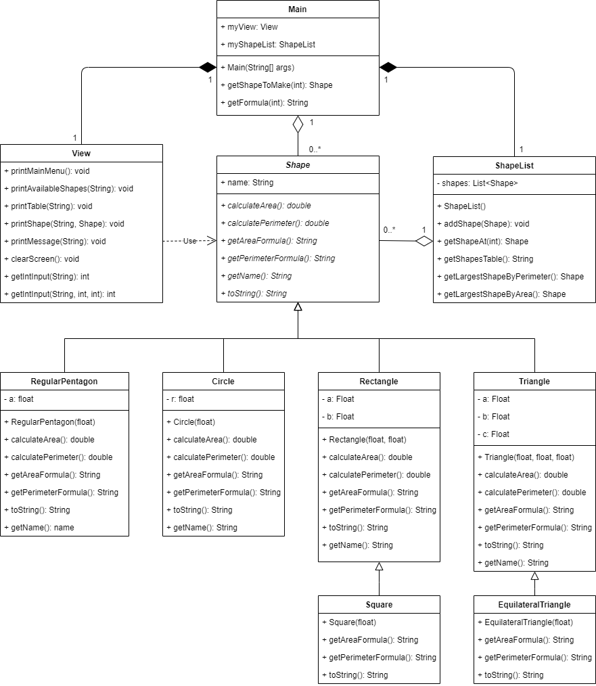

# Java exercise 2 - Geometry with OOP
Second project done during OOP workshops in Codecool. The goal was to get familiar with inheritance concept and abstract classes in Java.

## General info
The Geometry program allows user to add new shapes to the list, calculate their area and perimeter and seek for biggest shapes. User can print their shapes in the form of table:

User has a clear menu presented to them. With basic input validation, most UX activities are made foolproof.

## UML class diagram
The diagram below presents basic relations between classes in the program. It is visibe that inheritance has been a strong emphasis in the project and the rest of relations were inspired by mvc design pattern.

## Technologies
* Java SE 13

## Lessons learned from the assignment
* Working with basic OOP structures and concepts
* Getting familiar with exception handling in Java

## Status
Project is finished.

## Credits
Project assigned and supervised by Codecool mentors.

